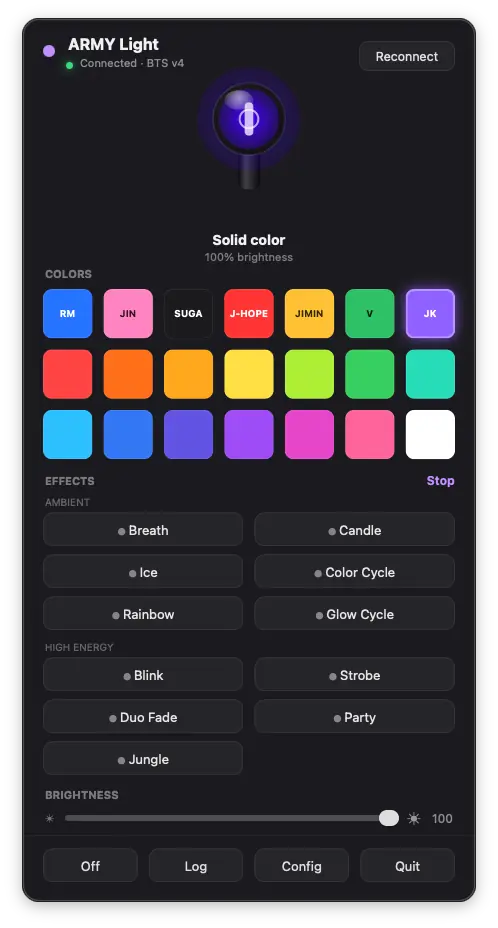
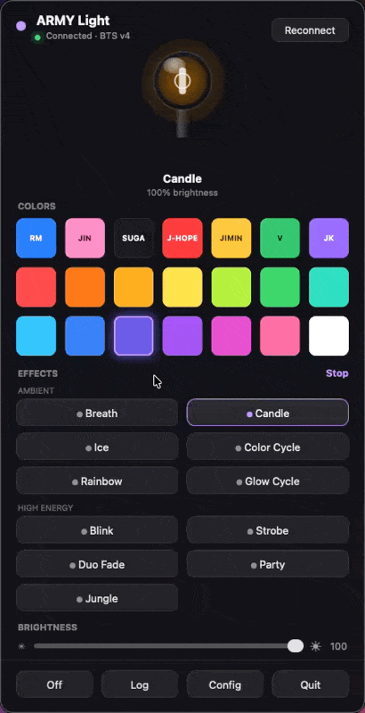
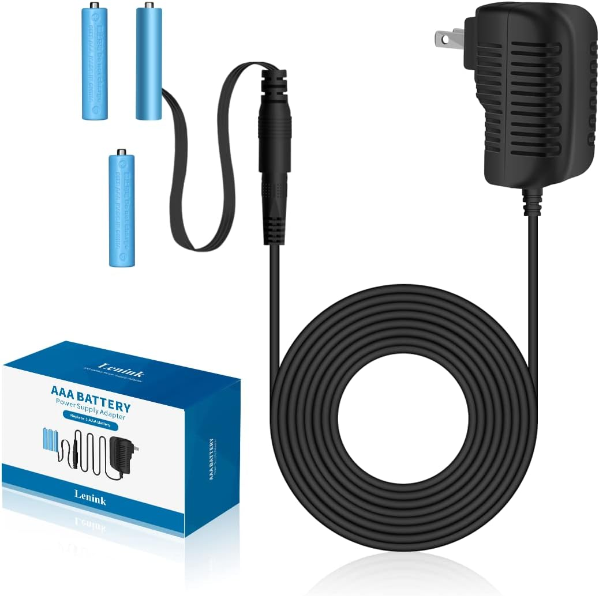

# ARMY Light

Control a BTS **ARMY Bomb Ver. 4** lightstick from your Mac — colors, effects,
and brightness from a menu-bar panel. No phone app required.

<p align="center">
  
</p>

Click the 💜 in the menu bar (solid when the light is on, outline when off) and
the panel stays open while you play:

- **Glowing hero wand** that mirrors the real wand live — color, brightness, state
- **Member row** — RM, JIN, SUGA, J-HOPE, JIMIN, V, JK in their signature
  colors, plus **14 spectrum colors** below (colors are LED-true on the wand:
  fully saturated hues, no washed-out whites)
- **11 effects** in Ambient / High-energy groups — Blink, Breath, Strobe,
  Duo Fade (gradient between your last two colors), Color Cycle, Rainbow
  (classic ROYGBIV march), Glow Cycle (brightness breathing through the hues),
  Candle, Party, Jungle, and Ice
- **Brightness slider** — live dimming of everything
- **Reconnect button** — fresh scan + reconnect any time the wand wanders off

See it in action:

<p align="center">
  
</p>

## Get the app

**Option A — download (easiest).** Grab the latest `ARMY Light.app` from the
[Releases page](https://github.com/jjanisheck/army-light/releases), unzip it, and
drag it to **Applications**. (Unsigned build: first launch → right-click → **Open**.)

**Option B — build it yourself.**

```bash
git clone https://github.com/jjanisheck/army-light.git
cd army-light
make dev          # create a venv + install
make app          # build dist/ARMY Light.app
open "dist/ARMY Light.app"
```

Drag `dist/ARMY Light.app` to **Applications** to keep it, and add it to **Login
Items** to start at boot. To brand a personal build, set your own bundle id:
`export ARMYLIGHT_BUNDLE_ID=com.you.armylight` (or put that in a gitignored
`local.mk`).

<p align="center">
  
</p>

## Use it

1. Put the wand in **Bluetooth mode** (hold the handle button ~2s until it
   blinks blue) and make sure it's **not connected to the phone app** — only one
   device can control it at a time.
2. Launch ARMY Light — a 💡 appears in the menu bar. Click it to open the panel.
3. Click a color. The **first click takes ~5–8s** (scan + a one-time handshake
   the wand requires per power-on); after that everything is instant over a
   persistent connection.

Bluetooth permission: macOS asks once on first use — allow it. If the wand stops
responding entirely, it has usually stopped advertising — press its button (or
flip its switch) and hit **Reconnect**. More help: the
[install & troubleshooting guide](docs/INSTALL.md).

### Run it plugged in (no batteries)

The wand runs on 3× AAA (~5 hours) — fine for concerts, not for a permanent desk
light. A **AAA battery eliminator** (~$15.49,
[this one on Amazon](https://www.amazon.com/dp/B0874HWL2L)) swaps the batteries
for dummy cells wired to a wall adapter, so the wand stays on forever:

<p align="center">
  
</p>

Drop the dummy cells into the battery compartment and, with a little careful
winding, route the flat cable so it comes out at the bottom of the handle — the
cap still closes over it. (You *could* Dremel/drill a hole for the wire, but you
don't have to.)

## Requirements

macOS with Bluetooth, and a BTS ARMY Bomb **Ver. 4** ("BTS_V4 LS"). Building
from source needs Python 3.9+.

## How it works

A menu-bar overlay panel (AppKit via PyObjC) on the main thread, all Bluetooth
(`bleak`) on a background asyncio thread. It speaks the ARMY Bomb Ver. 4 BLE
protocol — a 4-byte color write with a hardware fade byte, plus a one-time
session "latch" per connection — then streams colors over a persistent link.
Effects are app-driven step generators (the wand's own animation engine is not
reachable over BLE; we checked thoroughly). Full details — architecture, the
verified packet format, the connection model, and the discovery CLI for
confirming/extending support — are in **[docs/PROTOCOL.md](docs/PROTOCOL.md)**.

> Status: **verified end-to-end on a real ARMY Bomb Ver. 4** (`BTS_V4 LS`,
> Elcomtec). The Fanlight-family format used by sibling lightsticks ships as a
> fallback. If a color doesn't take on your unit, the built-in `army-light
> probe` tool finds the right values — see the protocol doc.

## Stream Deck / Shortcuts / automation

While the app is running it serves a **localhost-only remote control** on
`http://127.0.0.1:8722` (configurable via `control_port` in the config file;
`0` disables it):

```
/color/red            /color/army-purple        /color/00ff7f    /color/255,0,0
/effect/glow-cycle    /effect/blink?color=blue  /effect/duo-fade?color=red&color2=blue
/brightness/40        /stop                     /off             /reconnect    /status
```

**Stream Deck (easiest — built-in, verified):** drag the **System → Website**
action onto a key, paste a control URL (e.g.
`http://127.0.0.1:8722/effect/rainbow`), and tick **"GET request in
background"** — the button fires silently without opening a browser. One key
per color/effect (Red, Glow Cycle, Off, …). Works perfectly.

**Alternatives:** an Apple **Shortcut** with a "Get Contents of URL" action
assigned via Stream Deck's Shortcuts action, or plugins like *Web Requests* —
all pointing at the same URLs.

**Custom plugin (richest):** this repo ships a native Stream Deck plugin under
[`streamdeck/`](streamdeck/) that mirrors the entire Mac app as **39 ready-made
actions**: every palette color as a pre-colored swatch key (drag "ARMY Purple"
straight onto a key), every effect with a themed icon (rainbow gradient for
Rainbow, icy blues for Ice, ember tones for Candle, …), brightness presets
(10/25/50/75/100% with a fill gauge), and Off / Stop Effect / Reconnect. Four
extra "Custom …" actions add a full color picker (any RGB), per-effect color
pickers, and arbitrary percents. The manifest and icons are generated from the
app's own palette/effects registries (`streamdeck/generate.py`), so the deck
stays in sync with the app. **Install instructions, usage, and troubleshooting:
[streamdeck/README.md](streamdeck/README.md)** — short version:

```bash
cp -R streamdeck/com.armylight.control.sdPlugin \
  ~/Library/Application\ Support/com.elgato.StreamDeck/Plugins/
killall "Stream Deck"; open -a "Elgato Stream Deck"
```

Then drag actions from the **ARMY Light** category onto keys. No build step, no
dependencies — the plugin just calls the localhost remote above.

From a terminal it's just `curl http://127.0.0.1:8722/color/red`.

## Run from source (developers)

```bash
make dev
make run          # python -m army_light
make test         # pytest
make lint         # ruff
```

The `army-light` command (after `pip install -e .`) exposes the discovery CLI:
`scan`, `inspect`, `probe`, `monitor`. See [docs/PROTOCOL.md](docs/PROTOCOL.md).
An experimental native iOS app lives under [`ios/`](ios/README.md), speaking the
same verified V4 protocol.

## License

[The Unlicense](LICENSE) — public domain. Do whatever you want.

## Contributing

Issues and PRs welcome. Run `make lint test` before opening a PR. If you confirm
the protocol on a specific ARMY Bomb version, please note it in an issue.
